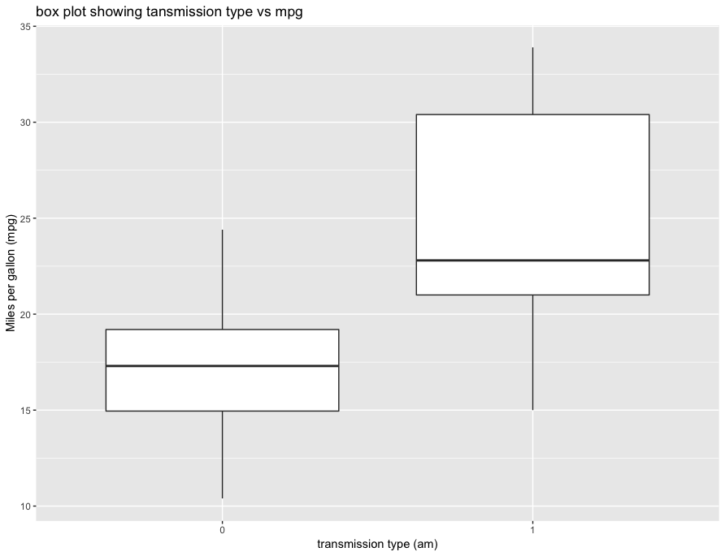

# mtcars visualisation
## cookbook in R

This repo contains code to create some basic visualizations in `R` using `mtcars` (an inbuilt dataset) and library `ggplot2`.

### Requirements:

* Make sure you've got `ggplot2` package installed 

### Sample Plot

